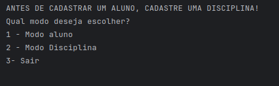
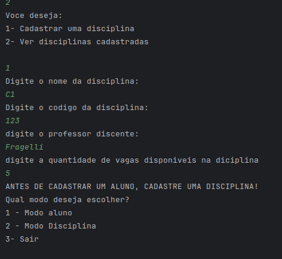
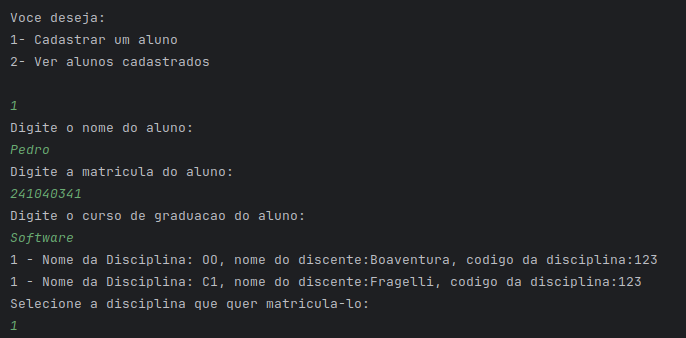

# Sistema Acadêmico - FCTE

## Descrição do Projeto

Desenvolvimento de um sistema acadêmico para gerenciar alunos, disciplinas, professores, turmas, avaliações e frequência, utilizando os conceitos de orientação a objetos (herança, polimorfismo e encapsulamento) e persistência de dados em arquivos.

O enunciado do trabalho pode ser encontrado aqui:
- [Trabalho 1 - Sistema Acadêmico](https://github.com/lboaventura25/OO-T06_2025.1_UnB_FCTE/blob/main/trabalhos/ep1/README.md)

## Dados do Aluno

- **Nome completo:** Pedro Henrique Galdino de Andrade Wollmann
- **Matrícula:** 241040341
- **Curso:** Engenharias
---

## Instruções para Compilação e Execução

1. **Compilação:**  
   - No diretorio raiz
      ```javac *.java```
2. **Execução:**  
      ````java Main````
3. **Estrutura de Pastas:**  
```css
orientacao-a-objetos/
├── src/
│   ├── Aluno.java
│   ├── AlunoEspecial.java
│   ├── Disciplina.java
│   ├── Main.java
│   └── Menu.java
├── disciplinas/             
├── prints/                
├── teste.csv                 
└── README.md

```
3. **Versão do JAVA utilizada:**  
   Neste projeto foi utilizada a versão 24 do java
---

## Vídeo de Demonstração

https://www.youtube.com/watch?v=5z6ZX5arFvU
---

## Prints da Execução

1. Menu Principal:  
   
---
2. Cadastro de disciplina:


3. Cadastro de Aluno:  
   


---

## Principais Funcionalidades Implementadas

- [ ] Cadastro, listagem, matrícula e trancamento de alunos (Normais e Especiais)
- [ ] Cadastro de disciplinas e criação de turmas (presenciais e remotas)
- [ ] Matrícula de alunos em turmas, respeitando vagas e pré-requisitos
- [ ] Lançamento de notas e controle de presença
- [ ] Cálculo de média final e verificação de aprovação/reprovação
- [ ] Relatórios de desempenho acadêmico por aluno, turma e disciplina
- [ ] Persistência de dados em arquivos (.txt ou .csv)
- [ ] Tratamento de duplicidade de matrículas
- [ ] Uso de herança, polimorfismo e encapsulamento

---

## Observações (Dificuldades)

- Não foi utilizada nenhuma IA para a ajuda da realização do trabalho, entanto foram utilizados sites como StackOverflow e videos didaticos no youtube
- Gerenciar arquivos foi algo muito novo para mim, e foi complicado aprender como escrever e ler informações desses arquivos


---

## Contato

- pedro.wollmann@gmail.com
