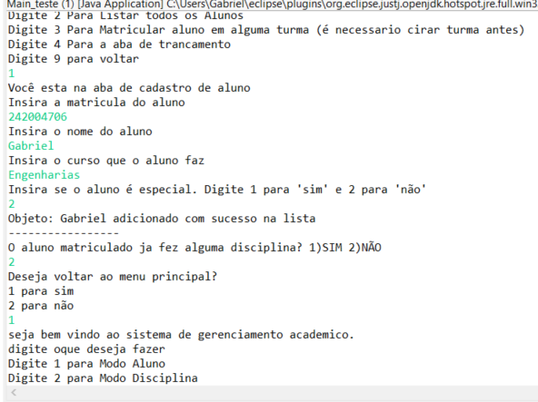
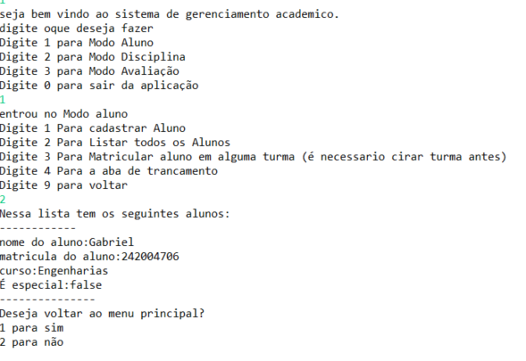

# Sistema Acadêmico - FCTE

## Descrição do Projeto

Desenvolvimento de um sistema acadêmico para gerenciar alunos, disciplinas, professores, turmas, avaliações e frequência, utilizando os conceitos de orientação a objetos (herança, polimorfismo e encapsulamento) e persistência de dados em arquivos.

O enunciado do trabalho pode ser encontrado aqui:
- [Trabalho 1 - Sistema Acadêmico](https://github.com/lboaventura25/OO-T06_2025.1_UnB_FCTE/blob/main/trabalhos/ep1/README.md)

## Dados do Aluno

- **Nome completo:** Gabriel vieira octacilio pinheiro 
- **Matrícula:** [242004706]
- **Curso:** [Engenharias]
- **Turma:** [06]

---

## Instruções para Compilação e Execução

1. **Compilação:**  
   [A principio só descompactar ele no vs que é mais lúdico e rezar pra funcionar]
    

2. **Execução:**  
   [quando executar o main ele vai chamar o menu que vai chamar os metodos pra cada funcionalidade desejada]
    

3. **Estrutura de Pastas:**  
   é recomendado descompactar na pasta C:\Temp

3. **Versão do JAVA utilizada:**  
   [Tenta com a 21 se nao for c a 21 tenta com a 17]

---

## Vídeo de Demonstração

- [Inserir o link para o vídeo no YouTube/Drive aqui]
Não vai ter vídeo

---

## Prints da Execução

1. Menu Principal:  
   ](caminho/do/print1.png)
   Vou ver se consigo arranjar alguns prints 

2. Cadastro de Aluno:  
   ](caminho/do/print2.png)

3. Relatório de Frequência/Notas:  
   

---

## Principais Funcionalidades Implementadas

- [ ] Cadastro, listagem, matrícula e trancamento de alunos (Normais e Especiais)
- [ ] Cadastro de disciplinas e criação de turmas (presenciais e remotas)
- [ ] Matrícula de alunos em turmas, respeitando vagas e pré-requisitos
- [ ] Lançamento de notas e controle de presença
- [ ] Cálculo de média final e verificação de aprovação/reprovação
- [ ] Relatórios de desempenho acadêmico por aluno, turma e disciplina
- [ ] Persistência de dados em arquivos (.txt ou .csv)
- [ ] Tratamento de duplicidade de matrículas
- [ ] Uso de herança, polimorfismo e encapsulamento

---

## Observações (Extras ou Dificuldades)

- Alem do mal gerenciamento do tempo, em questão de difilcudades tecnincas eu acredito que a falta do conhecimento sobre os principios de OO me prejudicou bastante. A falta de estruturação do projeto como um todo me prejudicou pq fez com que eu fizesse de um jeito, pra depois apagar e fazer denovo, se eu tivesse decidido, parado pra pensar no começo teria me ajudade mais. 
   Tecnologias que eu nem fazia ideia de mexer eu tive dificuldade, como por exeplo a serialização de objetos.
   o menu via interface tbm, pensei que seria facil mas acabou sendo bem difícil. 
   Mas acredito que oque fez com que eu entregasse esse trabalho podre foi o mal gerenciamneto de tempo mesmo, foquei em outras coisas e dei pouca prioridade pro projeto.
   Dificuldades próprias da linguagem java tbm, nada muito simples pq isso eu entendia mas coissinhas pequenas como por exemplo a forte tipagem de java me atrapalhou um pouco, não sabia como lidar com ela. 

---

## Contato

- [Opcional: E-mail pessoal do aluno.]
   gabriel.otacilio135@gmail.com
